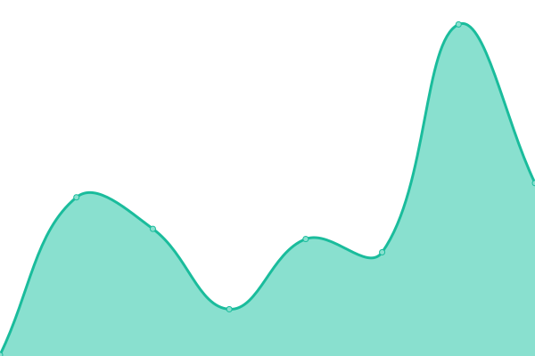
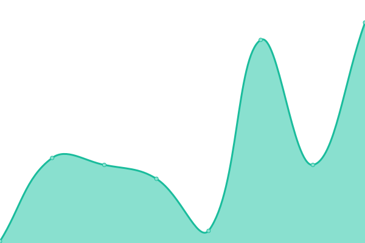
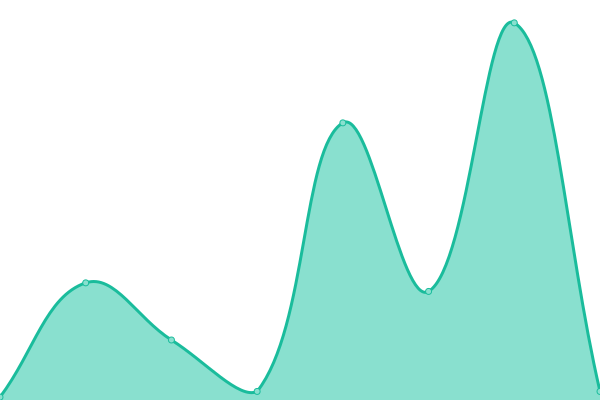
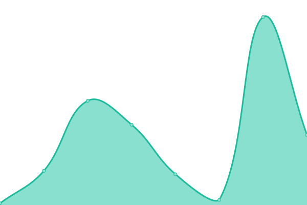
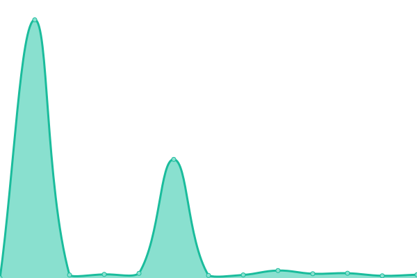

# [📈 Live Status](https://canadaxfx.github.io/web-status): <!--live status--> **🟩 All systems operational**

This repository contains the open-source uptime monitor and status page for [canadaxfx](https://canadaxfx.github.io/web-status), powered by [Upptime](https://github.com/upptime/upptime).

With [Upptime](https://upptime.js.org), you can get your own unlimited and free uptime monitor and status page, powered entirely by a GitHub repository. We use [Issues](https://github.com/canadaxfx/web-status/issues) as incident reports, [Actions](https://github.com/canadaxfx/web-status/actions) as uptime monitors, and [Pages](https://canadaxfx.github.io/web-status) for the status page.

<!--start: status pages-->
<!-- This summary is generated by Upptime (https://github.com/upptime/upptime) -->
<!-- Do not edit this manually, your changes will be overwritten -->
<!-- prettier-ignore -->
| URL | Status | History | Response Time | Uptime |
| --- | ------ | ------- | ------------- | ------ |
|  [XZ Studio Gallery](https://xz-studio-gallery.com/) | 🟩 Up | [xz-studio-gallery.yml](https://github.com/canadaxfx/web-status/commits/HEAD/history/xz-studio-gallery.yml) | 

 205ms
     
 | 

<a href="https://canadaxfx.github.io/web-status/history/xz-studio-gallery">100.00%</a>
    

|  [XZ HD Gallery Misc](https://canadaxfx.github.io/XZ-HD-Gallery-Misc/) | 🟩 Up | [xz-hd-gallery-misc.yml](https://github.com/canadaxfx/web-status/commits/HEAD/history/xz-hd-gallery-misc.yml) | 

 128ms
     
 | 

<a href="https://canadaxfx.github.io/web-status/history/xz-hd-gallery-misc">100.00%</a>
    

|  [XZ Social Media Archive](https://canadaxfx.github.io/XZ-social-media-archive/) | 🟩 Up | [xz-social-media-archive.yml](https://github.com/canadaxfx/web-status/commits/HEAD/history/xz-social-media-archive.yml) | 

 47ms
     
 | 

<a href="https://canadaxfx.github.io/web-status/history/xz-social-media-archive">100.00%</a>
    

|  [Screen Arts of Xiao Zhan](https://canadaxfx.github.io/XZworks/) | 🟩 Up | [screen-arts-of-xiao-zhan.yml](https://github.com/canadaxfx/web-status/commits/HEAD/history/screen-arts-of-xiao-zhan.yml) | 

 39ms
     
 | 

<a href="https://canadaxfx.github.io/web-status/history/screen-arts-of-xiao-zhan">100.00%</a>
    

|  [XZ Screen Universe on YouTube](https://canadaxfx.github.io/XZYT/) | 🟩 Up | [xz-screen-universe-on-you-tube.yml](https://github.com/canadaxfx/web-status/commits/HEAD/history/xz-screen-universe-on-you-tube.yml) | 

 55ms
     
 | 

<a href="https://canadaxfx.github.io/web-status/history/xz-screen-universe-on-you-tube">100.00%</a>
    

|  [Xiao Zhan Social Media Hub](https://canadaxfx.github.io/xiaozhan/) | 🟩 Up | [xiao-zhan-social-media-hub.yml](https://github.com/canadaxfx/web-status/commits/HEAD/history/xiao-zhan-social-media-hub.yml) | 

 46ms
     
 | 

<a href="https://canadaxfx.github.io/web-status/history/xiao-zhan-social-media-hub">100.00%</a>
    

|  [Claude-Powered Text Editor](https://claude-text-editor.onrender.com/) | 🟩 Up | [claude-powered-text-editor.yml](https://github.com/canadaxfx/web-status/commits/HEAD/history/claude-powered-text-editor.yml) | 

 1370ms
     
 | 

<a href="https://canadaxfx.github.io/web-status/history/claude-powered-text-editor">99.15%</a>
    

|  [Email Reply App](https://email-reply-app.onrender.com/) | 🟩 Up | [email-reply-app.yml](https://github.com/canadaxfx/web-status/commits/HEAD/history/email-reply-app.yml) | 

 4269ms
     
 | 

<a href="https://canadaxfx.github.io/web-status/history/email-reply-app">99.31%</a>
    

<!--end: status pages-->

[**Visit our status website →**](https://canadaxfx.github.io/web-status)

## 📄 License

- Powered by: [Upptime](https://github.com/upptime/upptime)
- Code: [MIT](./LICENSE) © [Anand Chowdhary](https://anandchowdhary.com), supported by [Pabio](https://pabio.com)
- Data in the `./history` directory: [Open Database License](https://opendatacommons.org/licenses/odbl/1-0/)
